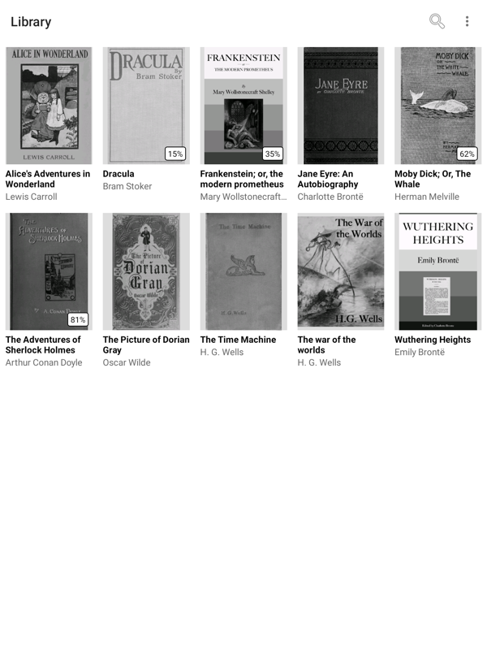
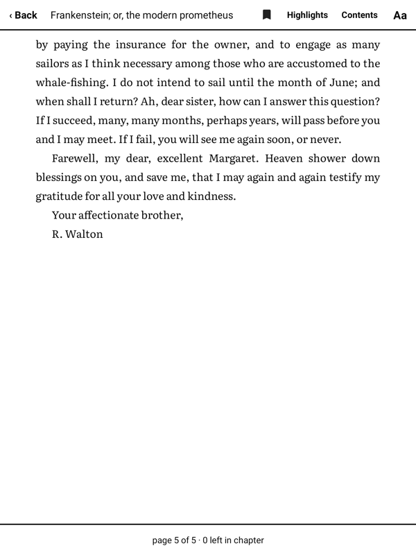
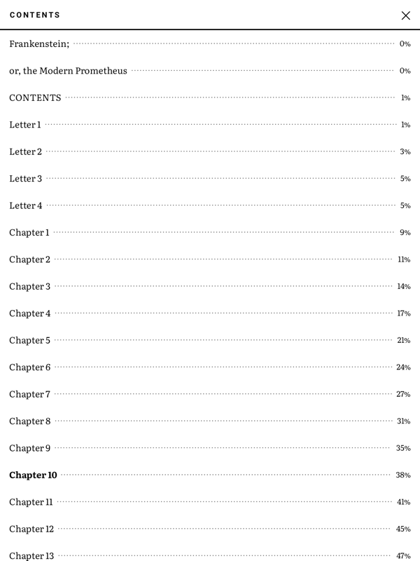
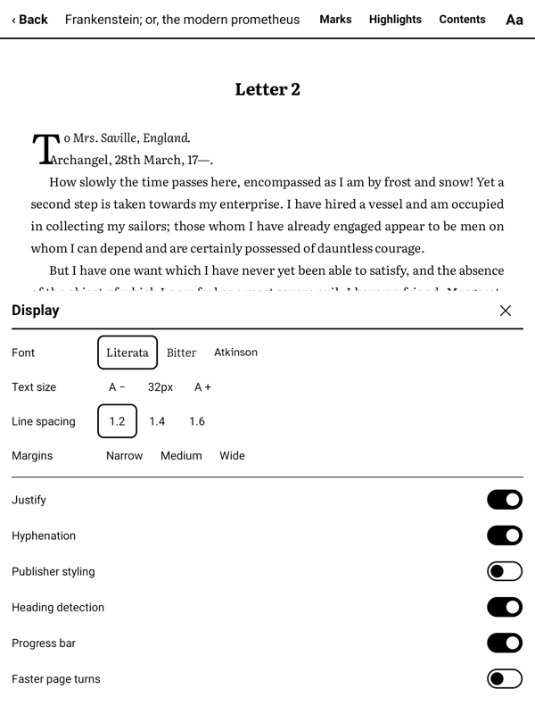

<p align="center">
  
</p>

<h1 align="center">Reader</h1>

<p align="center">A quiet EPUB reader built for Supernote e-ink tablets.</p>

---

Reading apps are usually designed for phones, where redrawing the screen is free and an animation
costs nothing. E-ink is the opposite. Every redraw is visible, slow, and paid for in battery, and
motion leaves a ghost of itself behind on the glass.

So Reader is built backwards from the usual. It draws a page once, then does nothing at all until
you ask for the next one. Nothing animates. Nothing polls. Sitting on a page with a book open, the
app uses **no measurable CPU at all**.

<p align="center">
  
</p>

## What you get

* **Your books, with covers**, scanned from a folder on the device and remembered where you left
  off; how far in you are shows as a small badge on the cover
* **Typography that behaves like a book**: justified text with real hyphenation, generous margins,
  centered chapter openings, three bundled typefaces
* **Two columns when you turn the tablet sideways**, a spread rather than one very wide column
* **Pen highlighting** that knows your stylus from your palm
* **Bookmarks, a contents page set like a printed one, and search** by title or author
* **A chapter scrubber**, with a tick for every chapter, a preview of the page you'd land on as you
  drag, and **↩** to jump back — a progress bar at the foot of the page marks where the current
  chapter ends
* **A clean page every turn**, with a faster mode when you would rather trade a little ghosting for
  speed; menus repaint quickly too, without touching the page's own crisp refresh

Reader opens **EPUB files only**. No PDF, no CBR, no CBZ.

## Getting it on your Supernote

**1. Download the APK.** Take the latest `sn-reader-*.apk` from the
[Releases page](https://github.com/rephlex00/sn-reader/releases).

**2. Install it over USB.**

```
adb install -r sn-reader-2026.07.2.apk
```

Debug mode needs to be on first. It lives in the Supernote's own Settings under security and
privacy, though the exact wording moves between firmware versions. Check `adb devices` lists your
tablet before installing.

Updating later keeps everything. Your library, positions, bookmarks, and highlights live in the
app's own storage, not in the APK.

**3. Let it read your files.** Reader asks on first launch. If you miss the prompt:

> Settings > Apps > Special access > All files access > Reader

This one is not optional. Your books sit in shared storage and Android will not hand them over
without it.

**4. Add books.** Drop `.epub` files into the **Document** folder, where Supernote keeps its own.
Reader finds them next time you open it, and you can point it somewhere else from its settings.
Scanning is incremental, so a big library does not mean a slow start.

## Reading

### Your shelf

<p align="center">
  
</p>

Tap a book to open it exactly where you stopped. Anything you have started shows how far in you are.

The toolbar searches by title or author as you type, filters by whether you have finished something,
sorts your shelf, and switches between covers and a list. Search looks across the whole library at
once, ignoring whichever folder you happen to be in.

### Turning pages

No swiping. A sliding page is precisely the thing that smears on e-ink. The screen is three tap
zones instead:

| Where you tap | What happens |
| --- | --- |
| The left edge, roughly a quarter of the width | Back a page |
| The right side, roughly the last 40% | Forward a page |
| The strip between them | Show or hide the toolbar |

Forward is the largest of the three, so reading is one unhurried tap after another.

### Turning it sideways

Rotate the tablet and the page becomes two columns with a gutter between them. One column across a
landscape screen would run to about a hundred characters a line, far past what is comfortable, so
Reader gives you a spread instead, the shape of an open book.

A tap turns both pages at once, and the foot tells you where you are: `pages 3–4 of 12`. A spread
never runs across a chapter boundary, so a chapter with an odd number of pages ends with a blank
right-hand column, exactly as a printed one does.

Rotating keeps your place. Not your page *number* — the text reflows into narrower columns, so the
numbering changes — but the words you were reading stay on screen. The book is not reopened, and it
costs a single clean refresh.

If you would rather it stayed put, **Lock rotation** in the **Aa** panel pins the reader to whichever
way it is currently facing, which is what you want when reading on your side. Your shelf and the
settings screens stay upright either way.

### The toolbar

<p align="center">
  
</p>

**Back** returns to your shelf. The **bookmark** opens your saved pages, where you can also mark the
one you are on. **Highlights** collects everything you have marked with the pen. **Contents** jumps
by chapter. **Aa** is how the page looks.

Every panel closes with the ✕ in its corner. The Supernote has no back button of its own, so
nothing here is a dead end.

### Marking passages

Highlights are made with the **pen**. Reader tells the stylus from your finger, so you can rest a
hand on the glass without leaving marks behind.

Drag the pen across a passage and the highlight follows the nib as you draw. Tap one you have
already made and a delete button appears. The **Highlights** panel lists them all, each with its
chapter and how far into the book it sits.

### Chapters

<p align="center">
  
</p>

**Contents** shows the book's chapters with your current one in bold. Tap to go there.

### How the page looks

<p align="center">
  
</p>

**Aa** opens display settings: three bundled typefaces (Literata, Bitter, Atkinson Hyperlegible,
each with proper italics and bold), text size, line spacing, margins, and switches for
justification and hyphenation.

**Publisher styling** decides whether a book keeps its own formatting or gets tidied into Reader's
consistent look. Changing anything reflows the text and keeps your place.

### The flash between pages

By default every page turn does a full e-ink refresh. That is the brief black blink you know from
other e-readers, and it leaves the next page perfectly clean with nothing of the last one left
behind.

If you would rather turn pages quickly, switch on **Faster page turns**. Pages then update with a
light, fast refresh and Reader does a full clean-up flash every few pages instead, every 3, 6, or
10 as you prefer. You trade a little ghosting between flashes for speed.

## Worth knowing

* Tested on a Supernote Nomad. It should work on a Manta, but that has not been confirmed.
* Sideloaded, not from any app store.
* Everything stays on your device. No accounts, no sync, and the app never touches the network.
* What changed between releases is in [`CHANGELOG.md`](CHANGELOG.md).

## License

[Apache 2.0](LICENSE). Use it, change it, redistribute it, including commercially. If you plan to
package or redistribute, read [`NOTICE`](NOTICE) first for the third-party details.

---

## Building it yourself

Kotlin, Gradle, and plain Android Views on purpose. Not Compose, not a WebView: both redraw far more
than a still page needs, which is the whole thing this project is trying to avoid.

Four modules. `:engine` is pure Kotlin with no Android dependency, holding the pagination logic so it
can be tested on an ordinary JVM. `:formats` parses EPUB and measures text. `:data` is the
Room-backed book index. `:app` is the interface.

You need JDK 21 and the Android SDK, including one package that is easy to miss:

```
sdkmanager "platform-tools" "platforms;android-36" "platforms;android-37.1" "build-tools;36.0.0"
```

`platforms;android-37.1` is not a typo. The build sets `compileSdk = 37` because a dependency
demands it. Without that package the build fails with an error naming an AAR file rather than the
missing platform, which is a confusing hour if you have not hit it before.

Point Gradle at your SDK with a `local.properties` in the repo root:

```
sdk.dir=/path/to/android-sdk
```

Then:

```
./gradlew test
./gradlew :app:assembleDebug
adb install -r app/build/outputs/apk/debug/app-debug.apk
```

Two things to leave alone unless you want a bad afternoon: the Android Gradle Plugin brings its own
Kotlin compiler, so do not apply the Kotlin Android plugin separately, and do not move Kotlin past
2.2.10. A mismatch there crashes compiler-plugin startup rather than failing with anything you can
read.
