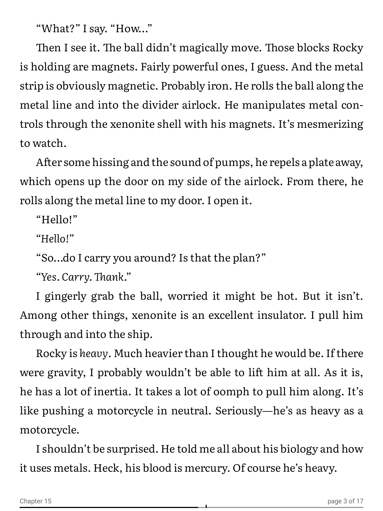
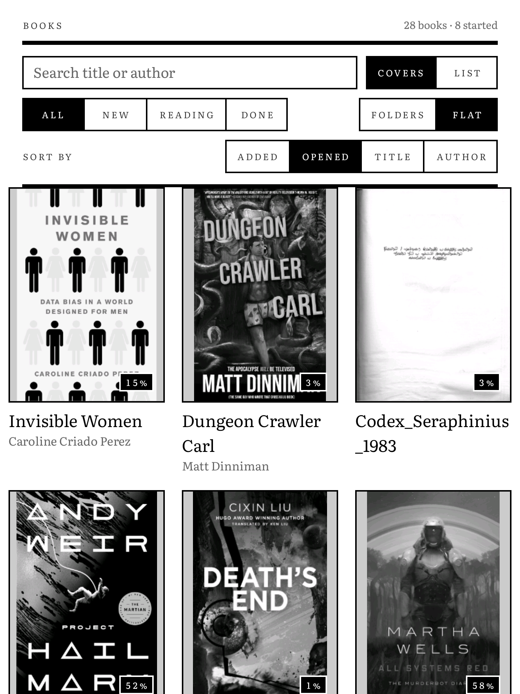
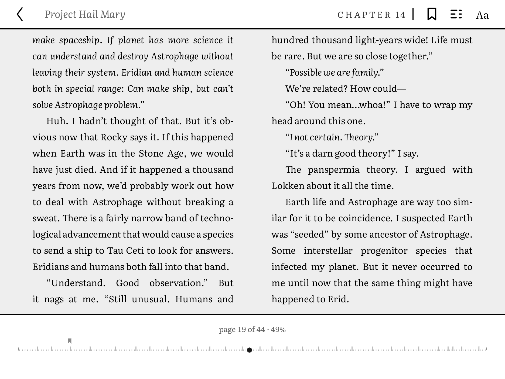
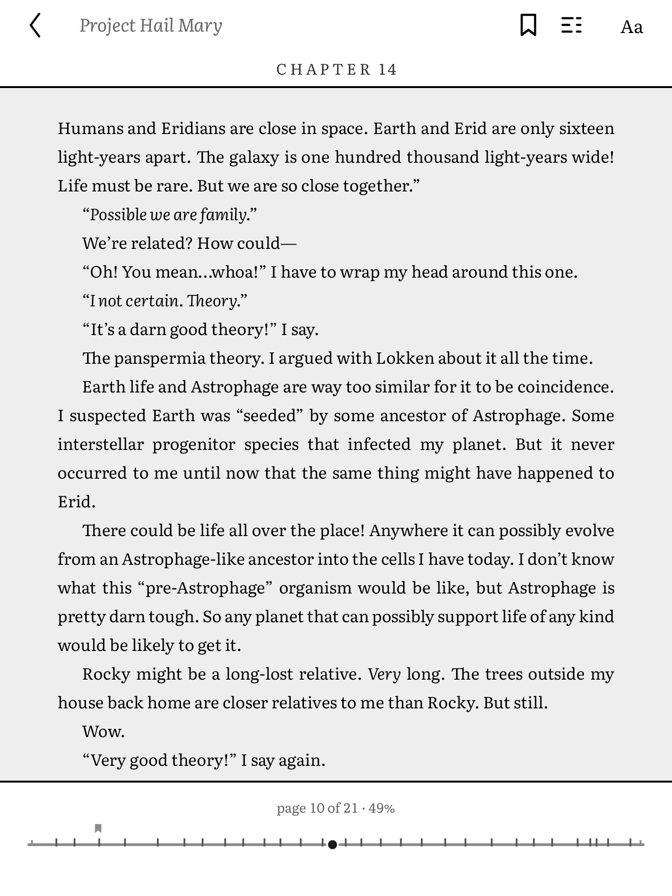
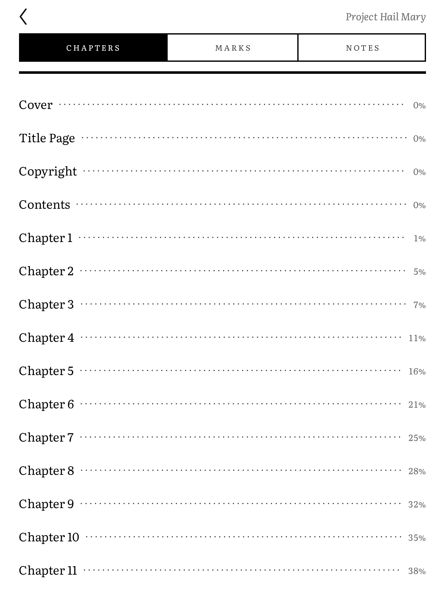
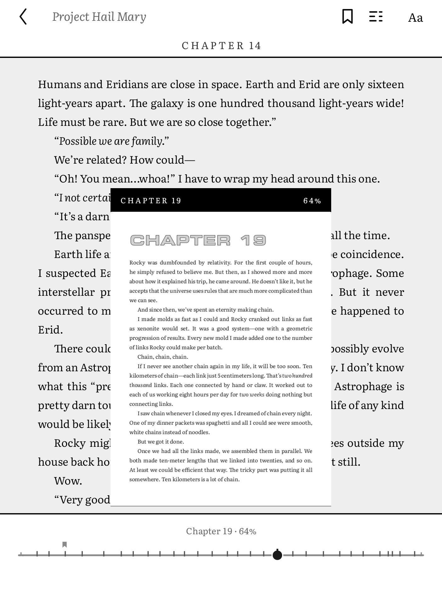
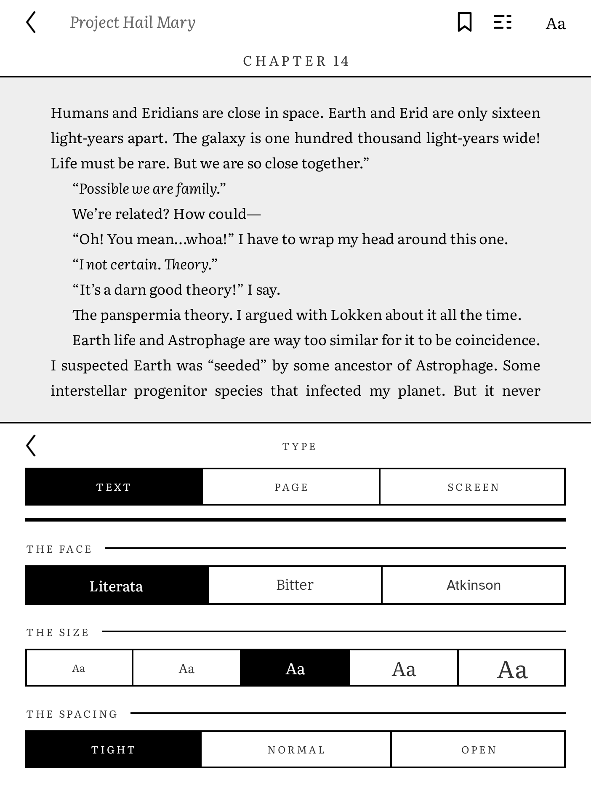
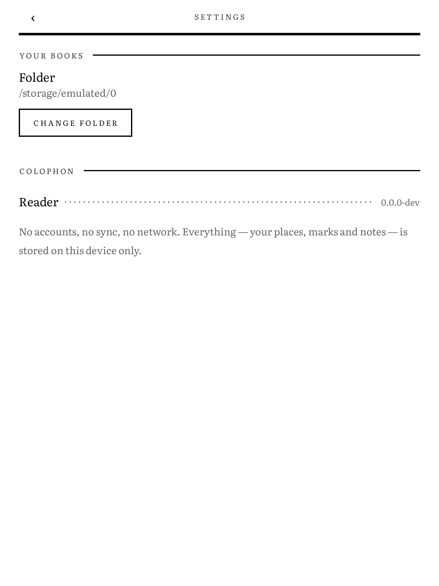

<p align="center">
  
</p>

<h1 align="center">Reader</h1>

<p align="center">A quiet reader for EPUB, MOBI and comics, built for Supernote e-ink tablets.</p>

---

Reading apps are usually designed for phones, where redrawing the screen is free and an animation
costs nothing. E-ink is the opposite. Every redraw is visible, slow, and paid for in battery, and
motion leaves a ghost of itself behind on the glass.

So Reader is built backwards from the usual. It draws a page once, then does nothing at all until
you ask for the next one. Nothing animates. Nothing polls. Sitting on a page with a book open, the
app uses **no measurable CPU at all**.

<p align="center">
  
</p>

## What you get

* **Your books, with covers**, scanned from a folder on the device and remembered where you left
  off; how far in you are shows as a small badge on the cover
* **Typography that behaves like a book**: justified text with real hyphenation, generous margins,
  centered chapter openings, three bundled typefaces
* **Two columns when you turn the tablet sideways**, a spread rather than one very wide column
* **Pen highlighting** that knows your stylus from your palm
* **Bookmarks, a contents page set like a printed one, and search** by title or author
* **A chapter scrubber**, with a tick for every chapter, a preview of the page you'd land on as you
  drag, and a **Return** control to jump back — a progress bar at the foot of the page marks where the current
  chapter ends
* **One typeface throughout**, the book's own: the shelf, the chrome and the page are set in the
  same face, and every choice in the app is the same bordered cell
* **Comics too** — CBZ and zip-backed CBR, one page per screen with per-book reading direction for
  manga, in the same library as your books and with the same timeline, previews and bookmarks
* **A clean page every turn**, with a faster mode when you would rather trade a little ghosting for
  speed; menus repaint quickly too, without touching the page's own crisp refresh

Reader opens **EPUB**, **MOBI**, **CBZ**, and **CBR** files that are really zips (many are). A genuine RAR
archive does not open yet. No PDF.

MOBI support covers the un-DRMed mobi7 books that make up most sideloaded `.mobi` files, and they
read exactly as EPUBs do — same chrome, same Contents, same marks and typography. Two kinds are
refused, by name rather than silently: anything with DRM, and **AZW3/KF8**, which is what Amazon
ships today. Those say so on the shelf instead of appearing broken.

## Getting it on your Supernote

**1. Download the APK.** Take the latest `sn-reader-*.apk` from the
[Releases page](https://github.com/rephlex00/sn-reader/releases).

**2. Install it over USB.**

```
adb install -r sn-reader-2026.07.6.apk
```

Debug mode needs to be on first. It lives in the Supernote's own Settings under security and
privacy, though the exact wording moves between firmware versions. Check `adb devices` lists your
tablet before installing.

Updating later keeps everything. Your library, positions, bookmarks, and highlights live in the
app's own storage, not in the APK.

**3. Let it read your files.** Reader asks on first launch. If you miss the prompt:

> Settings > Apps > Special access > All files access > Reader

This one is not optional. Your books sit in shared storage and Android will not hand them over
without it.

**4. Add books.** Drop `.epub`, `.mobi`, `.cbz` or `.cbr` files into the **Document** folder, where Supernote
keeps its own. Reader finds them next time you open it, and you can point it somewhere else from
its settings. Scanning is incremental, so a big library does not mean a slow start.

## Reading

### Your shelf

<p align="center">
  
</p>

Tap a book to open it exactly where you stopped. Anything you have started shows how far in you are.

Above the shelf is a search field that filters by title or author as you type and reports how many
books matched, and a row of controls for what you are looking at: covers or a list, all books or
just the new / part-read / finished ones, folders or flat, and the sort order. Nothing is hidden
behind a menu. Search looks across the whole library at once, ignoring whichever folder you happen
to be in.

### Turning pages

No swiping. A sliding page is precisely the thing that smears on e-ink. The screen is three tap
zones instead:

| Where you tap | What happens |
| --- | --- |
| The left edge, roughly a quarter of the width | Back a page |
| The right side, roughly the last 40% | Forward a page |
| The strip between them | Show or hide the chrome |

Forward is the largest of the three, so reading is one unhurried tap after another.

### Turning it sideways

<p align="center">
  
</p>

Rotate the tablet and the page becomes two columns with a gutter between them. One column across a
landscape screen would run to about a hundred characters a line, far past what is comfortable, so
Reader gives you a spread instead, the shape of an open book.

A tap turns both pages at once, and the foot tells you where you are: `pages 3–4 of 12`. A spread
never runs across a chapter boundary, so a chapter with an odd number of pages ends with a blank
right-hand column, exactly as a printed one does.

Rotating keeps your place. Not your page *number* — the text reflows into narrower columns, so the
numbering changes — but the words you were reading stay on screen. The book is not reopened, and it
costs a single clean refresh.

If you would rather it stayed put, **Lock rotation**, under **Aa › Screen**, pins the reader to whichever
way it is currently facing, which is what you want when reading on your side. Your shelf and the
settings screens stay upright either way.

### The toolbar

<p align="center">
  
</p>

The chrome is two rows. The first is the book you are in and everything you can do about it: a
**‹** back to your shelf, the book's title beside it, then a **mark ribbon**, **Contents**, and
**Aa** — the two marks about the book together, then the one about the page. The second row is a
running head carrying the chapter, centred, where a printed page puts it — and standing down on a
chapter opener, because the page below is already carrying its own heading.

While the chrome is up, the page steps back by one level of the sixteen this display can hold — the
smallest change it can make without dithering. The bars are paper and the page was paper too, so
nothing said which of the two you were meant to touch. Only the ground moves; the words are still
black, and still readable at a glance.

The ribbon is the one control here whose look is a fact rather than a door: outlined when the page
you are on is unmarked, filled when it is. Tap it to mark the page in place, without leaving what
you are reading.

**Contents** is one surface holding three lists behind a **Chapters · Marks · Notes** header —
where you are in the book, the pages you have marked, and the passages you have marked with the
pen. It opens on whichever of the three you left it on, per book. **Aa** is how the page looks.

Both close with the **‹** at the top-left, in the same place on each. That mark is drawn rather
than typed, at the screen's own edge: it is the only way out of a book on a device with no back
button of its own, so its tap target runs to the glass rather than stopping at the text margin.

### Marking passages

Highlights are made with the **pen**. Reader tells the stylus from your finger, so you can rest a
hand on the glass without leaving marks behind.

Drag the pen across a passage and the highlight follows the nib as you draw. Tap one you have
already made and a delete button appears. The **Highlights** panel lists them all, each with its
chapter and how far into the book it sits.

### Chapters

<p align="center">
  
</p>

**Contents** sets the book's chapters as a printed contents page — leader dots carrying the eye
across to each percentage — with the one you are in bold and marked in the margin. Tap to go there.
**Marks** and **Notes** sit behind the same header: the pages you have marked, and the passages you
have marked with the pen, grouped under the chapter they came from. A mark carries the opening
words of the page it saved, so the list reads as places in the book rather than as a column of
chapter numbers.

### Skimming the whole book

<p align="center">
  
</p>

The timeline along the bottom of the toolbar has a tick for every chapter. Drag it and a floating
window shows the page you would land on — instantly, from thumbnails prepared once in the
background the first time a book is opened — while a readout names the chapter and percentage.
The page itself never repaints during a drag; it is drawn once, when you let go. The thumb snaps
to chapter starts like a detent, bookmarks sit on the track as small glyphs, and after any jump
**Return** appears beside the readout to take you back to exactly where you were.

### How the page looks

<p align="center">
  
</p>

**Aa** opens a sheet across the bottom of the screen, with your book still showing above it, behind
three tabs: **Text** (the face, the size, the spacing), **Page** (margins, justification,
hyphenation, and what this book is allowed to do to itself), and **Screen** (page turns, the
progress bar, rotation, previews).

The sheet stops short of the top on purpose. Every control in **Text** reflows the chapter under
it, so you choose a typeface and a size by watching your own book change rather than by picking
blind and finding out afterwards. **Text** is the shortest of the three tabs for exactly that
reason — it is the one you judge by looking up.

Every choice in the app is the same shape: a row of bordered cells with the chosen one filled in.
A typeface, a margin and a plain on/off are all that one control, so there is a single thing to
learn. Text size is five cells drawn at the sizes they produce, and the three typefaces are each
set in themselves, at the size your page is currently using — so you pick by looking, not by
reading a name.

**Publisher styling** decides whether a book keeps its own formatting or gets tidied into Reader's
consistent look. Changing anything reflows the text and keeps your place.

### The flash between pages

By default every page turn does a full e-ink refresh. That is the brief black blink you know from
other e-readers, and it leaves the next page perfectly clean with nothing of the last one left
behind.

If you would rather turn pages quickly, switch on **Faster page turns**. Pages then update with a
light, fast refresh and Reader does a full clean-up flash every few pages instead, every 3, 6, or
10 as you prefer. You trade a little ghosting between flashes for speed.

### Comics

Reader opens **CBZ** comic archives, and **CBR** files that are really zips (many are). Pages are
shown one at a time, fit to the screen, turned with the same taps as a book. Reading direction
follows the archive's `ComicInfo.xml`, and you can flip it per book for manga.

Comics sit in the same library as your books, with the first page as the cover and the same
progress badge. Your place is kept per comic, and bookmarks work by page.

The reading chrome is the one you already know: a timeline along the bottom that you drag to move
through the comic, a floating preview of the page you would land on, the page readout above it, **Return**
to jump back after a scrub or a mark, and the same marks surface. A comic has no chapters, so
the track is one plain run rather than a ticked one, and previews are decoded as you drag instead of
rendered ahead of time.

Reader decides what a file really is by looking inside it, not by trusting the extension — so a
comic named `.cbr` that was actually written as a zip opens without complaint. A **genuine RAR**
archive does not open yet; Reader says so plainly rather than failing silently. Support can be
added later without changing anything else.

Two limits worth knowing. Comics are **portrait only** — turning the tablet sideways does not give
you a two-page spread the way a book does. And pages are **fit to the screen with no zoom**, which
suits manga and line art well; dense colour lettering can be marginal at that size.

### Settings

<p align="center">
  
</p>

Settings is the same surface again, and holds what belongs to the app rather than to a book: which
folder your books live in, and a colophon naming the version you are running. Everything about how
a page looks lives in **Aa**, beside the page it changes.

## Worth knowing

* Tested on a Supernote Nomad. It should work on a Manta, but that has not been confirmed.
* Sideloaded, not from any app store.
* Everything stays on your device. No accounts, no sync, and the app never touches the network.
* What changed between releases is in [`CHANGELOG.md`](CHANGELOG.md).

## License

[Apache 2.0](LICENSE). Use it, change it, redistribute it, including commercially. If you plan to
package or redistribute, read [`NOTICE`](NOTICE) first for the third-party details.

---

## Building it yourself

Kotlin, Gradle, and plain Android Views on purpose. Not Compose, not a WebView: both redraw far more
than a still page needs, which is the whole thing this project is trying to avoid.

Four modules. `:engine` is pure Kotlin with no Android dependency, holding the pagination logic so it
can be tested on an ordinary JVM. `:formats` parses EPUB and MOBI and measures text. `:data` is the
Room-backed book index. `:app` is the interface.

You need JDK 21 and the Android SDK, including one package that is easy to miss:

```
sdkmanager "platform-tools" "platforms;android-36" "platforms;android-37.1" "build-tools;36.0.0"
```

`platforms;android-37.1` is not a typo. The build sets `compileSdk = 37` because a dependency
demands it. Without that package the build fails with an error naming an AAR file rather than the
missing platform, which is a confusing hour if you have not hit it before.

Point Gradle at your SDK with a `local.properties` in the repo root:

```
sdk.dir=/path/to/android-sdk
```

Then:

```
./gradlew test
./gradlew :app:assembleDebug
adb install -r app/build/outputs/apk/debug/app-debug.apk
```

Two things to leave alone unless you want a bad afternoon: the Android Gradle Plugin brings its own
Kotlin compiler, so do not apply the Kotlin Android plugin separately, and do not move Kotlin past
2.2.10. A mismatch there crashes compiler-plugin startup rather than failing with anything you can
read.
